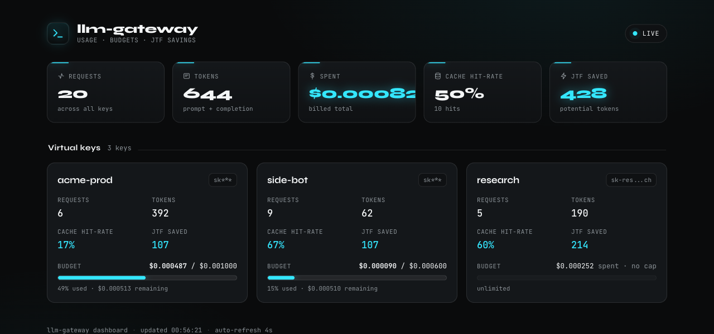

<div align="center">

# llm-gateway

**Экономный к токенам, self-hosted LLM-шлюз (прокси).**

Совместим с OpenAI · честный учёт токенов и стоимости · виртуальные ключи и бюджеты · кэш ответов · встроенный **JTF**

[English](README.md) · [Русский](README.ru.md)

</div>

---

`llm-gateway` — это обратный прокси на FastAPI, который ставится перед OpenAI,
Anthropic, Ollama или встроенным офлайн-провайдером **mock**. Ваши приложения
продолжают говорить по протоколу OpenAI Chat Completions, а шлюз добавляет
виртуальные API-ключи, **бюджеты** по каждому ключу, **кэш** ответов, честный
**учёт стоимости** и — главное отличие — встроенную наблюдаемость экономии
токенов через **JTF (JSON Token Format)** и опциональное сжатие.

Шлюз запускается и проходит весь набор тестов **без реальных API-ключей и без
сети** благодаря встроенному провайдеру mock.

## Зачем ещё один шлюз?

| | llm-gateway | LiteLLM | Helicone |
|---|---|---|---|
| Прокси, совместимый с OpenAI | ✅ | ✅ | ✅ |
| Виртуальные ключи + бюджеты | ✅ встроено (SQLite) | ✅ | ✅ (прежде всего SaaS) |
| Кэш ответов (Redis / память) | ✅ | ✅ | ✅ |
| Учёт стоимости | ✅ честный, по токенам | ✅ | ✅ |
| **Наблюдаемость экономии JTF** | ✅ **всегда, без изменения промпта** | ❌ | ❌ |
| **Сжатие промпта JTF (по выбору)** | ✅ **экспериментально, lossless** | ❌ | ❌ |
| Работает полностью офлайн (mock) | ✅ | частично | ❌ |
| Self-hosted, без привязки к SaaS | ✅ | ✅ | частично |

Честный смысл: **большинство шлюзов оценивают стоимость — и на этом
останавливаются.** Этот ещё и показывает для каждого запроса, сколько токенов вы
*могли бы* сэкономить, кодируя «тяжёлые» по JSON промпты эффективнее, — и
позволяет это сделать, когда вы сами того захотите. Это и есть функция
[JTF](#jtf-главное-отличие).

## Архитектура

```
                    ┌──────────────────────────────────────────────┐
  OpenAI SDK  ──▶   │  FastAPI-приложение  (app.py)                 │
  (base_url =       │    аутентификация (Bearer vkey)               │
   шлюз)            │    POST /v1/chat/completions  (+ SSE-стрим)   │
                    │    GET  /v1/models                            │
                    │    GET  /admin/usage  /admin/pricing          │
                    │    GET  /dashboard  (админ-UI Electric Cyan)  │
                    └───────────────┬──────────────────────────────┘
                                    ▼
                    ┌──────────────────────────────────────────────┐
                    │  Сервис Gateway  (gateway.py)                 │
                    │   1. маршрут model → провайдер+модель+fallback│
                    │   2. проверка модели по allow-list ключа      │
                    │   3. JTF-анализ (всегда) / сжатие (по выбору) │
                    │   4. поиск в кэше  (попадание ⇒ $0, помечено) │
                    │   5. предпроверка бюджета  (превышение ⇒ 402) │
                    │   6. provider.chat(...)  (+ fallback)        │
                    │   7. cost = usage × price → атомарная запись  │
                    └───┬───────────┬───────────┬──────────┬────────┘
                        ▼           ▼           ▼          ▼
                  providers/    cache.py     store.py   pricing.py
                  mock·openai·  Redis |      SQLite     цена за Mtok
                  anthropic·    память       ключи+учёт таблица
                  ollama
```

- **`gateway.py`** не зависит от фреймворка: принимает и возвращает обычные
  словари, поэтому им можно управлять из FastAPI, CLI или тестов без HTTP.
- **`store.py`** — SQLite для ключей и учёта; атомарный `UPDATE` для
  безопасности бюджета.
- **`cache.py`** — Redis, если он настроен и доступен, иначе прозрачный
  откат в память (тестам Redis не нужен).
- **`_vendor/jtf/`** — эталонная библиотека JTF, вендорится (MIT, с указанием
  авторства), чтобы у ключевой функции не было лишних зависимостей.

## Быстрый старт

```sh
python -m venv .venv && source .venv/bin/activate
pip install -e ".[dev]"

# Запуск сервера (без конфига: провайдер mock + ключ «sk-gw-dev»).
uvicorn llm_gateway.app:app --reload
```

Затем в другом терминале — рабочий запрос к офлайн-провайдеру **mock**:

```sh
curl -s http://localhost:8000/v1/chat/completions \
  -H "Authorization: Bearer sk-gw-dev" \
  -H "Content-Type: application/json" \
  -d '{"model":"mock-echo","messages":[{"role":"user","content":"привет"}]}'
```

### Использование из OpenAI SDK

```python
from openai import OpenAI
client = OpenAI(base_url="http://localhost:8000/v1", api_key="sk-gw-dev")
resp = client.chat.completions.create(
    model="mock-echo",
    messages=[{"role": "user", "content": "привет"}],
)
print(resp.choices[0].message.content)
```

Достаточно направить `base_url` на шлюз — существующий код на OpenAI SDK
работает без изменений.

### Стриминг (`stream: true`)

Установите `"stream": true` — и шлюз вернёт **Server-Sent Events** в стиле
OpenAI (`Content-Type: text/event-stream`): последовательность кадров
`data: {chunk}\n\n` с объектами `chat.completion.chunk` (у каждого
`choices[].delta`), завершаемую `data: [DONE]\n\n`. OpenAI SDK читает это
нативно:

```python
stream = client.chat.completions.create(
    model="mock-echo",
    messages=[{"role": "user", "content": "stream me"}],
    stream=True,
)
for chunk in stream:
    print(chunk.choices[0].delta.content or "", end="", flush=True)
```

Или через `curl`:

```sh
curl -N http://localhost:8000/v1/chat/completions \
  -H "Authorization: Bearer sk-gw-dev" -H "Content-Type: application/json" \
  -d '{"model":"mock-echo","messages":[{"role":"user","content":"hi"}],"stream":true}'
```

Как это работает:

- **Предпроверка бюджета выполняется до старта стрима** — запрос сверх лимита
  отклоняется с **HTTP 402** (чистой JSON-ошибкой), а не «поломанным» стримом.
- Содержимое и **токены usage накапливаются и записываются по ключу *после*
  завершения стрима** (финальный кадр также содержит блок `usage`).
- **Кэш для стриминговых запросов обходится** (нет единого объекта, который
  можно отдать на лету) — нестриминговые запросы по-прежнему используют
  точный кэш.
- Провайдер **mock** имитирует потоковую отдачу по токенам; **OpenAI** стримит
  через passthrough; **Anthropic** транслирует дельты своего Messages SSE в
  чанки OpenAI.

## Конфигурация

Без конфига шлюз поднимается на провайдере mock с dev-ключом — удобно для
ознакомления и для CI. Для реальных апстримов скопируйте `config.example.yaml`
в `config.yaml` и запустите с `GATEWAY_CONFIG=config.yaml`. В файле три раздела:

- **`providers`** — адаптеры и учётные данные (читаются из env через `api_key_env`).
- **`routing`** — клиентская `model` → `provider` + `upstream_model` (+ опциональный `fallback`).
- **`keys`** — виртуальные ключи: `allowed_models`, `max_usd`, `max_tokens`, `cache_enabled`.

Управление ключами через CLI (пишет в ту же базу SQLite, что читает сервер):

```sh
llm-gateway create-key --name alice --max-usd 5 --models mock-echo,mock-cheap
llm-gateway list-keys
llm-gateway usage
```

### Бюджеты

У каждого ключа может быть `max_usd` и/или `max_tokens`. Запрос, чья оценочная
стоимость превысила бы лимит, отклоняется **до** траты — с кодом **HTTP 402** и
понятной JSON-ошибкой:

```json
{"error":{"message":"budget exceeded: spend $… would exceed cap $1.00",
          "type":"insufficient_quota","code":"budget_exceeded"}}
```

### Кэширование

Ключ кэша — это SHA-256 от `(upstream_model, messages, параметры сэмплинга)`.
Идентичный повторный запрос возвращает ответ из кэша, **тарифицируется в $0** и
помечается через `X-Cache: HIT` и `usage.gateway.cache_hit`. Отключение для
запроса — заголовком `X-Cache: no-store`, для ключа — `cache_enabled: false`.
Используется Redis, если `redis_url` задан и доступен, иначе — словарь в памяти.

### Учёт стоимости

Цены лежат в стартовой таблице (`pricing.py`), в USD **за 1M токенов**, в стиле
LiteLLM:

| семейство моделей | вход $/Mtok | выход $/Mtok |
|---|---|---|
| claude-3-opus | 5 | 25 |
| claude-3.5-sonnet | 3 | 15 |
| claude-3.5-haiku | 1 | 5 |
| gpt-4o | 2.5 *(проверить)* | 10 *(проверить)* |

Версионированные id (`claude-3-5-sonnet-20241022`) сопоставляются с ценой
семейства по самому длинному префиксу. Записи с пометкой *проверить* стоит
сверить с актуальным прайс-листом провайдера перед биллингом — цены меняются.
Обновление из JSON в стиле LiteLLM — через `pricing.load_litellm_prices(doc)`
(чистая функция, без сети).

## JTF: главное отличие

[JTF — JSON Token Format](src/llm_gateway/_vendor/jtf/) — это lossless,
обратимое кодирование модели данных JSON, которое стоит **меньше токенов**, чем
`json.dumps`, для структурированных данных (повторяющиеся ключи объектов
выносятся в одну строку-заголовок, для повторяющихся строк строится словарь
значений и т. д.). Шлюз использует JTF двумя способами:

1. **Наблюдаемость — всегда, без изменения промпта.** Каждый запрос
   сканируется на JSON-подобное содержимое, и мы сообщаем, сколько токенов JTF
   *сэкономил бы*. Пересылаемый промпт при этом **не меняется**. Данные видны в
   `usage.gateway.jtf.potential_tokens_saved`, в заголовке
   `X-JTF-Potential-Tokens-Saved` и в `/admin/usage`. Это и есть обещание
   бренда: честный учёт токенов с показом той экономии, которую вы пока теряете.

2. **Сжатие — по выбору, экспериментально.** Передайте `X-JTF-Compress: true`,
   и шлюз перекодирует крупные, явно JSON-блоки сообщений в JTF *перед*
   пересылкой, уменьшая число токенов промпта.

> ⚠️ **Честная оговорка.** Сжатие JTF lossless на проводе
> (`decode(encode(x)) == x`), но **апстрим-модель должна понимать JTF**, чтобы
> корректно работать с данными. Поэтому оно **опциональное и консервативное**:
> затрагиваются только однозначно JSON-блоки выше порога размера и только когда
> JTF действительно выигрывает; блок помечается заголовком `[[JTF/v2]]`, а
> исходный объект запроса никогда не мутируется. Относитесь к этому как к
> эксперименту: измеряйте качество на своей нагрузке или добавьте системный
> промпт, обучающий модель формату. У стороны *наблюдаемости* такой оговорки
> нет — она бесплатна и всегда корректна.

## Наблюдаемость

- Структурированное логирование запросов (строки в таблице SQLite `request_log`).
- `GET /admin/usage` — **итоги по портфелю** плюс по каждому ключу: запросы,
  токены, потраченные $, **остаток бюджета**, **доля попаданий в кэш** и
  **потенциальная экономия JTF**.
- `GET /admin/pricing` — активная таблица цен.
- Заголовки ответа: `X-Cache`, `X-Cost-USD`, `X-Provider`, `X-JTF-*`.

### Дашборд

Аккуратный самодостаточный админ-дашборд отдаётся по **`GET /dashboard`**. Он
автообновляется (каждые 4 с, с индикатором «live»), запрашивает `/admin/usage`
и рисует шапку с итогами (всего запросов · токенов · потрачено $ · доля
попаданий в кэш · сэкономлено токенов JTF) плюс карточки по ключам с
**прогресс-баром «потрачено $ против бюджета»** (cyan → amber → red по мере
заполнения), долей попаданий в кэш и экономией JTF. Корректно отображается при
нулевых данных, адаптивен под мобильные. Чистый ванильный JS без сборки, иконки —
встроенные SVG, учитывается `prefers-reduced-motion`.



> Дашборд доступен по `/dashboard`. Если задан `admin_token` (см. ниже),
> открывайте его как `/dashboard?admin_token=<token>` — страница передаст токен
> в свой запрос данных.

### Админ-доступ (опционально)

`/admin/*` **по умолчанию открыт**, чтобы быстрый старт и дашборд работали из
коробки. Чтобы закрыть его, задайте `admin_token` в `config.yaml` (или
`$GATEWAY_ADMIN_TOKEN`). Затем передавайте его заголовком `X-Admin-Token` либо
как `?admin_token=...` для дашборда. Сама HTML-страница `/dashboard` остаётся
публичной; защищаются именно **данные** за ней (`/admin/usage`).

## Docker

```sh
docker compose up --build      # шлюз на :8000 + redis на :6379
```

`docker-compose.yml` сам связывает шлюз с Redis; при недоступном Redis шлюз
продолжает работать (откат в память).

## Разработка и тесты

```sh
pip install -e ".[dev]"
ruff check .
pytest                 # всё зелёное, без ключей и без сети
```

Тесты покрывают аутентификацию (401), маршрутизацию/форму OpenAI, бюджеты (402),
кэш (попадание тарифицируется в $0), математику стоимости, трансляцию Anthropic,
оба пути JTF, **SSE-стриминг** и форму **дашборда + `/admin/usage`** — всё на
провайдере mock.

## Дорожная карта

- **Семантический кэш** (попадания по близким эмбеддингам), сверх точного совпадения.
- **Больше провайдеров**: Google Gemini, Mistral, Bedrock, Azure OpenAI.
- Аутентификация по admin-токену для `/admin/*`, метрики Prometheus, rate limiting.
- Вариант хранилища на Postgres для большей конкурентности.

## Лицензия

MIT © 2026 Maxim Chumakov. Вендорит эталонную реализацию JTF
(MIT, тоже © 2026 Maxim Chumakov) в `src/llm_gateway/_vendor/jtf/`.
